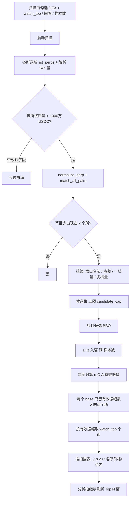

# 套利扫描 · 设计方案

分支：`strategy/sliding-window`  
状态：**已落地**（与仓库同步）。下文是实现口径；未写进本文的行为不要顺手加。  
相关：[`滑动窗口-阶段1-追STEP.md`](滑动窗口-阶段1-追STEP.md)、[`配置参考.md`](配置参考.md)。

页面勾选 DEX → `POST /api/scan/start` → 拉所选所全部永续（必须带 24h 合约量，**每所该币 > `scan.min_volume_24h_usdc`**，当前 yaml 默认 300 万）→ 两两配对（币至少出现在两个所）→ 盘口粗筛 → 对候选做窗口采样并打分 → 每币留最优两个所 → 取前 `watch_top`（默认 20）→ 表上 σ / Δ / μ / C 来自最优所对；各 DEX 列对候选币在勾选所上只要订到盘口就采 mid / 点差均值。

扫描**发现宇宙**，不依赖套利配置里手填的 symbol / 每格数量。扫描**不下单**。执行启动仍走现有 `pairs.enabled`。

---

## 1. 目标与非目标

**目标**

- 从勾选的 DEX 自动发现可做滑动窗口的所对，按**价差波动是否盖过一格**排序。
- 精算（μ、σ、点差均值、Δ）只打在前 N 行，避免全市场长连 WS。
- 与阶段 1 同一套量：mid 价差 \(s\)、枢纽 μ、点差平均 \(C\)、格距 Δ、有效振幅 \(\sigma-\Delta\)。

**非目标（本文不包含，实现时禁止顺带做）**

- 扫描结果一键写入套利配置并开仓
- 用瞬时 raw 毛价差当排序键（锁死基差、薄盘会刷屏）
- 流通市值排序（永续所没有统一、可靠的流通市值）
- 把扫描环和统一决策环合成一条环

适配器可以**只读扩展** `list_perps` / meta：必须带上 24h 合约名义成交量。不改下单与 WS 协议。

---

## 2. 与现网的差别

| | 现网 `loop_scan` | 本方案 |
|---|---|---|
| 宇宙 | 用户填写的 symbol ∩ 所交集 | 勾选所 `list_perps`，**24h 量 > 1000 万** 后再两两交集 |
| 启动 | `/api/arbitrage/start`，仍要交易对和数量 | 扫描专用启动，**不要** qty / symbol |
| 排序 | 瞬时可成交 raw 降序，截 `watch_top` | 粗筛后窗口 \(\sigma-\Delta\)，每币最优两所，再截 N |
| 订阅 | 对已匹配对订 BBO | 先廉价盘口/元数据粗筛；只对候选（及最终 Top N）长连 |
| 扣 nat | 已拆 | 不扣 nat。μ 自己吸收稳定偏移 |
| 页面 | 示意数据 | `/api/snapshot`（或扫描专用字段）推真实行 |

---

## 3. 总流程



拍频：发现/匹配只在启动和「重扫」时跑。粗筛可每 `coarse_refresh_secs` 重跑一次（默认 60s），避免候选集冻死。精算跟 `analysis_interval_ms`（页面已有，默认 50ms）刷盘口；**入窗仍 1Hz**，与格子相同，不要 50ms 写一次窗。

---

## 4. 启动与互斥

### 4.1 页面

- 勾选所：现有 `store.scan_venues`（至少 2 个）。启动时必须写入运行时，作为本次扫描的 `active_venues`。
- 配置：只留 `watch_top`、`analysis_interval_ms`、**样本数**。
- **样本数**：实现时改为扫描窗容量（秒级点数），**不要**再绑 `history.min_points`。建议 API 字段 `scan_window_samples`（yaml `scan.window_samples`），默认与现页一致用 10；满窗才有 σ / μ / C。与格子的 `grid.window_samples`（常见 1000）分开，扫描窗短、格子窗长。
- 「启动扫描」：打开扫描模式，**禁止**要求套利配置里的交易对和每格数量。
- 「停止扫描」：退订扫描订阅、清扫描表、关扫描模式。有执行仓时不要误清执行订阅（扫描与执行互斥，正常不会同时有仓）。

### 4.2 后端开关

现网 `/api/arbitrage/start` 会校验 `pairs` 非空。扫描不要走这条，或加明确 `mode=scan` 且跳过 pairs 校验。

建议：

- `POST /api/scan/start`：校验 `scan_venues ≥ 2`，置 `scan.enabled=true`、`control.enabled=true`（或独立 `scan_running`），`rematch` 走扫描宇宙而不是 `pairs.enabled`。
- `POST /api/scan/stop`：关扫描。不要误停正在执行的套利——实现时若发现 `execution` 在跑，扫描启动应 409 拒绝。
- 执行启动时：若扫描在跑，先停扫描再匹配执行名单（或 409 让用户先停）。**执行优先**。

无 HTTP 时：yaml `scan.enabled: true` 且 `execution.enabled: false` 才进扫描环；宇宙 = yaml `venues` 全交集（无页面勾选）。

---

## 5. 发现与配对

### 5.1 拉市场

对勾选的每个 venue：`adapter.list_perps()`。失败的所记警告并从本轮勾选里剔除；剩下不足 2 所则启动失败，页面提示。

`list_perps` 返回 `VenueMarket`：`venue / raw_symbol / pair_id / base / market_index / qty_precision / min_qty / volume_24h_usdc`。  
`volume_24h_usdc` 是该所该永续最近 24h 合约**报价名义**（稳定币按 1:1 记 USDC）。解析不到或 ≤ 0 视为该市场不合格。

**24h 量是硬门槛，不是可选项。** 有成交才有可交易的价差波动；无量或量太小的币不准进配对。  
阈值：`volume_24h_usdc > scan.min_volume_24h_usdc`（yaml，当前 `"3000000"`）。相等或更小、缺字段、单位解析失败，一律丢。yaml 写成 `0` 时代码仍按 1000 万执行，禁止关门。

过滤时机：在 `match_all_pairs` **之前**按所丢掉不合格市场，再两两配对。这样「只在一个所有量、另一个所没量/没字段」的币不会进宇宙。一条 `Pair` 的两腿因此都保证过量门。

不要用流通市值代替 24h 量。不要用 OI 代替 24h 量（OI 可作以后附加门，本文不要求）。

状态过滤沿用现适配器：Lighter `status=active`，SoDEX `TRADING`。不要在扫描里再发明一套符号白名单；扫描宇宙 = 适配器认为可交易、且 24h 量过门的永续。

### 5.2 归一与两两配对

沿用 `normalize_perp` + `match_all_pairs`：

- 稳定币报价 1:1：`BTC-USDC` ≡ `BTC-USDG` ≡ `BTC-USD` ≡ `vUSDC` 等，同一 `base` / `pair_id`（如 `BTC-USD-PERP`）。
- N 个所选所 → C(N,2) 条所对。四所时 6 条所对通道。
- `Pair.legs[0]` = `config/venues` 列表里更靠前的所（与现网一致）。扫描表「最优所对」展示时 L = 得分计算时的 `legs[0]`，不要按价格贵贱重排。
- 同家族：`is_cross_dex("lighter","lighter_rh") == false`。打分**不排除**同家族；表上可标「同家族」。同家族通常点差更薄、σ 中等，往往会进前排，这是预期不是 bug。

资格：某个 `base` 在所选所里出现次数 ≥ 2。只在一个所的币直接丢。

输出：`Vec<Pair>`（币 × 所对），例如 BTC 在四所上最多 6 条 `Pair`。

---

## 6. 粗筛（硬门槛，不是排序）

目的：在订 WS 之前丢掉明显不能做窗口网格的所对。24h 量已在 §5.1 滤完；本节是盘口门。**缺盘口数据 = 该所对失败**，不要跳过门槛让行混进来。

对每条 `Pair` 需要一张尽量廉价的双边盘口（见 §6.1）。门按顺序，任一硬门失败则该所对不进候选：

| 门 | 条件 | 缺数据 |
|---|---|---|
| 24h 量（复核） | 两腿 `volume_24h_usdc` 都 **> `min_volume_24h_usdc`** | 失败（与 §5.1 同一条；粗筛重跑时量过期/刷新后也可能被踢） |
| 盘口存在 | 两所都有 bid/ask | 失败 |
| 合法 | `Bbo.valid()`：bid>0、ask>0、ask>bid | 失败 |
| 新鲜 | 若已是 WS：age ≤ `data_freshness_ms`；若是 REST 快照：本轮拉取成功即可 | REST 失败则该所对本轮粗筛失败 |
| 本所点差 | yaml `max_own_spread_pct` 仍保留 | **现码不作硬门**；点差之和只用于候选排序 |
| 一档量 | yaml `min_level_notional_usdc` 仍保留 | **现码不作硬门** |

**不用**：流通市值、社交热度、资金费率（费率是执行滤网，不是扫描排序）。

粗筛通过后的所对进入**候选集**。候选上限 `candidate_cap`：建议 `max(watch_top×4, 40)`，在已过 24h 量的集合里按「两侧点差之和升序」截断（点差越薄越优先进候选）。点差比瞬时 raw 更接近「能否做市价开平」。量不参与排序，只做门。

### 6.1 粗筛盘口从哪来

禁止对交集里几百条腿全部 `subscribe_bbo`。

实现顺序：

1. **优先**：各所若已有「全市场 BBO REST」或 `list_perps` 已带 bid/ask，粗筛用 REST，零 WS。
2. **否则**：对**本轮尚未有盘口的候选**分批短订 WS（每批 ≤ 20 个 `Pair`，等齐 BBO 或超时 3s 后退订），滚完交集。超时视为粗筛失败。
3. 粗筛通过的候选再**长订** BBO，进入 §7。

Linux 上注意 FD：扫描进程不要对全宇宙 keep-alive 公共 WS。HTTP 面板 keep-alive 已在 `serve_http1_close` 处理，扫描不要再开一条「每币一条连接」的模式。

### 6.2 24h 量从哪来（实现约束）

单位统一为 **USDC 名义**（报价稳定币 1:1）。比较用 `>` 1000 万，不是 `≥`。

| 所 | 字段 |
|---|---|
| Entropy | asset ctx `dayNtlVlm` |
| Lighter 主网 / RH | ticker/stats 的 24h 报价成交额（两套实例各自的量） |
| SoDEX | symbols / tickers 的 `quoteVolume` |

三个所都要能给出数，扫描才能在四所间配对。某个所接口没有 24h 量：**该所全部市场不合格**，等于本轮没勾这个所，不要静默跳过量门。日志打 `volume_24h missing, venue excluded from scan match`。

重跑粗筛时允许重新 `list_perps`/meta 刷新量；量掉到门槛以下的市场从候选踢出。

---

## 7. 精算窗口与打分

只对候选集长订 WS。入窗与格子相同：合法盘口才写入；缺一秒不拿上一秒凑。

### 7.1 入窗

- 间隔：1Hz（`grid.sample_interval_ms` 默认 1000，扫描可共用，不必另配）。
- 容量：`scan.window_samples`（页面「样本数」）。未满：该所对状态 `sampling`，`n/cap`，**不参与排序、不占 watch_top**。
- 每条 `Pair`（slot_key = `pair_id|venue_a|venue_b`）一条 mid 价差窗；每个 venue 一条本所点差窗（可按所有候选共享：同一所 BTC 只一份点差窗）。

秒级样本：

\[
s=\frac{\mathrm{mid}_L-\mathrm{mid}_R}{(\mathrm{mid}_L+\mathrm{mid}_R)/2}\times 100
\]

\[
c_i=\frac{\mathrm{ask}_i-\mathrm{bid}_i}{\mathrm{mid}_i}\times 100
\]

满窗后：

- \(\mu=\mathrm{mean}(s)\)（价差均值 / 枢纽）
- \(\sigma=\mathrm{std}(s)\)（总体或样本标准差，实现时固定用**样本标准差** n−1，文档与代码一致即可）
- \(C=(\mathrm{mean}(c_L)+\mathrm{mean}(c_R))/2\)（点差均值）

各所 **价格均值** = 该所 mid 在同窗上的平均。

### 7.2 Δ 与有效振幅

与 `deltaFromTargetBp` / `grid_step_from_target_bp` 同一式：

\[
\Delta=\max\left(\frac{\texttt{target\_bp}/100+F+C}{1-2h},\; F+C\right)
\]

- `target_bp`：用 `pairs.defaults.target_bp`（扫描没有逐币覆盖）。
- \(F=2\times(\mathrm{taker}_L+\mathrm{taker}_R)\)，与 `market_round_trip_taker` 相同。
- \(h\)：`grid.step_hysteresis`。
- \(C\)：上款 live 均值。

有效振幅：

\[
\mathrm{edge}=\sigma-\Delta
\]

- \(\sigma\le\Delta\)：`eligible=false`，可进表但排在合格行后面，行变淡（与现示意表一致）。
- 排序键：先 `eligible` 降序，再 `edge` 降序。**μ 不参与排序。**

过格次数（可选列）：满窗后统计 \(|s_t-\mu|\ge\Delta\) 的秒数。不要再用 \(\mathrm{round}(cap\times 0.12\times e^{-z^2/2})\) 那种示意公式。

### 7.3 每个币只留两个所

对同一 `base`，在其所有**已满窗**的所对里取 `edge` 最大的一条 `Pair`。  
该币一行：最优所对 = 这条 Pair 的两所；有效振幅 / σ / Δ / μ / C 都来自这条 Pair。  
各 DEX 列：对该币（候选集里出现过的 `pair_id`），把宇宙里同币的其它所对也订上，并单独采 mid / 本所点差窗。Lighter×RH 点差更薄、占满候选时，SoDEX / Entropy 列仍能出均值。该所没有这个币、没过量门、没订到盘口、或未满 `window_samples` 显示 —。

`watch_top` 截的是**币的行数**，不是「方向条数」。不要把 BTC 的 Lighter×RH 与 Entropy×RH 同时占两行，除非产品以后改成「所对行」——本文规定 **一行一个 base**。

同分：优先同家族；再比 \(C\) 更小；再比 `base` 字母序。

---

## 8. 推送到页面

扫描结果不要复用执行带的 `snap.pairs`（那是格子 raw/net/intent）。新增快照字段，例如 `snap.scan`：

```text
updated_at
status: idle | starting | coarse | sampling | live | error
error: string?
universe: 交集所对条数
candidates: 候选条数
watch_top
window_samples / sample_interval_ms
rows: [
  rank, base, pair_id,
  left, right, same_family, eligible,
  edge, sigma, delta, mu, hub_c, crosses, n, cap,
  venues: { venue_id: { mid_mean, own_spread_mean } }
]
```

未满窗的候选**不要**塞进 `rows` 充当前 20。可用 `sampling_n` 在页头显示「候选 80 · 满窗 12 · 展示 12」。

页面：

- 勾选变化未点启动：表格可仍示意或空表，不要用过期宇宙。
- 启动后用 `snap.scan.rows` 替换示意数据。
- 表头悬停文案保持现逻辑（有效振幅、Δ、过格等）。
- 停止后清空 `rows`，status=`idle`。

分析拍：`analysis_interval_ms` 只负责读内存盘口、更新窗（到点才入窗）、重算排序、写快照。不要每 50ms 重跑 `list_perps`。

---

## 9. 重扫与生命周期

- 启动：list → match → 粗筛 → 订候选（并补订同币其它所）→ 采样直到满窗 → 出表。
- 每 `coarse_refresh_secs`（默认 60）：用最新 BBO 重跑粗筛。新进候选开始订约并采空窗；被踢出候选的退订、丢窗（已在 Top N 且仍满窗合格的，本周期可保留，避免表每分钟翻牌）。
- 勾选所变化：必须再点启动（或提供「应用勾选」）。不要在运行中偷偷改宇宙。
- 停止：退订扫描产生的订阅。不要动执行模式的订阅（互斥下本应为空）。

---

## 10. 配置清单（实现时）

页面三项：

| 页面 | yaml / API | 含义 |
|---|---|---|
| watch_top | `scan.watch_top` | 展示币行数，默认 20 |
| analysis_interval_ms | `scan.analysis_interval_ms` | 扫描拍，默认 50，下限 10 |
| 样本数 | `scan.window_samples` **（改绑）** | 满这么多个秒级点才打分，建议默认 60（约 1 分钟）；最小 10 |

仅 yaml、第一期页面可不暴露：

| 字段 | 建议默认 | 含义 |
|---|---|---|
| `scan.candidate_cap` | `max(watch_top×4, 40)` | 长订 WS 上限 |
| `scan.max_own_spread_pct` | `0.15` | 单所点差上限 % |
| `scan.min_level_notional_usdc` | `200` | 一档名义下限 |
| `scan.min_volume_24h_usdc` | 当前 yaml `"3000000"` | 单所该币 24h 合约名义下限（USDC）。**必须执行**，禁止 0=关闭（写成 0 时仍按 1000 万） |
| `scan.coarse_refresh_secs` | `60` | 粗筛重跑 |

`scan.enabled` 只作运行模式，不在「扫描/历史」里当旋钮。

---

## 11. 实现顺序

上列步骤均已进仓库。量门跟 yaml `min_volume_24h_usdc`；粗筛硬门是盘口合法 + 量复核（点差/一档量不作硬门）；候选币补订其它所填 DEX 列；粗筛刷新为空则保留当前候选。

---

## 12. 验收

- 只勾一个所：启动失败，提示至少两个。
- 四所启动：过 24h 量门之后才有 C(4,2) 交集计数；未填套利交易对也能启动。某所解析不出 24h 量则日志剔除该所，不拿无量市场配对。
- 量 ≤ `min_volume_24h_usdc` 的市场不出现在宇宙 / 表里。
- 扫描运行时点「启动套利」：拒绝或先停扫描，**不得**用扫描宇宙去下单。
- 未满样本数：表头显示采样进度，rows 为空或少于 20，不按 μ 排序。
- 满窗后：排序随有效振幅，Entropy 锁死贵一截但 σ 很小的币排在同家族高波动之后或标不够一格。
- 候选数有上限；`ss`/FD 不随交集线性涨到几百条 ESTAB。
- 停止扫描后表清空，WS 订阅回到空（或仅执行需要的）。

---

## 13. 现网不要用的做法（反例）

- 对 `list_perps` 交集全部长订 WS 再 `truncate(20)`。
- 用 `|mid_A-mid_B|` 或 raw 毛价差当唯一分数。
- 扫描启动继续要求 `base_qty`。
- 把 `history.min_points` 继续当作扫描样本数。
- 24h 量缺字段时跳过量门，或把 `min_volume_24h_usdc` 设 0 当关闭。
- 用一侧有量、另一侧无量的所对凑配对。
- 用 OI / 市值代替 24h 合约名义成交额。
