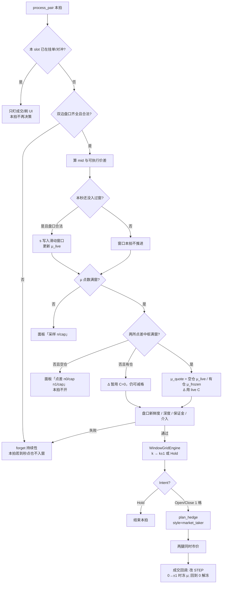

# 滑动窗口 · 阶段 1 开发设计：追 STEP

分支：`strategy/sliding-window`  
依赖：现有 `process_pair` 盘口门、保证金、`plan_hedge`、sidecar。  
下文：[`滑动窗口-阶段2-对称挂限价.md`](滑动窗口-阶段2-对称挂限价.md)  
原则：**只换意图层**。不改 `exchange/*` 适配器。本阶段执行锁定 **双腿市价**（`force_market_taker` → `plan.style=market_taker`），yaml/页面 `order.style` 默认仍是 `limit_then_market`，**发单跟 plan，不跟 yaml**。

---

## 1. 目标与非目标

**目标**

同一币、两所 L / R。用最近 10000 个秒级价差的均值当中枢 \(\mu\)。价差相对 \(\mu\) 偏离够一格、站住之后，用有符号 STEP 加减仓：空贵所、多便宜所。价差往 \(\mu\) 收则按格平。穿过中枢必须先回 0 再反向。

赚钱：偏离处开、靠近中枢处平，吃一格 \(\Delta\) 减四腿市价费和两所点差中枢的平均。不是绝对 T1，也不是赌单边涨跌。

**非目标（本阶段不做）**

- 对称预挂限价（阶段 2）
- 用窗口高低点等分格距
- 一拍跳多格
- BTC–ETH 配对 / z-score
- 剥头皮
- 改交易所适配器或 sidecar

---

## 2. 总流程（决策环每一拍）

决策环默认 100ms（`loop_interval_ms`）。入窗是 1Hz，两者叠在同一条 `process_pair` 里。

关键分离：

| 节拍 | 用什么价 | 干什么 |
|---|---|---|
| 1 秒 | 该秒 **一个** mid 价差 \(s\) | 填窗口、算 \(\mu\) |
| 100ms | 当前可执行 Ask/Bid | 持续性、是否发单、市价锁仓 |

---

## 3. 关键步骤说明

### 3.1 盘口门（沿用现网）

与现在 `process_pair` 相同：无盘口 / 无中价 / 点差过宽 / 不新鲜 → `forget`，本拍不决策。  
**入窗也走同一套合法盘口。** 缺盘口的那一秒不拿上一秒的 \(s\) 凑窗口。

已在 `pending`（限价）或 `hedging`（市价对冲中）的 slot：本拍只监视，不重复开仓。阶段 1 双腿市价主要走 `hedging`。

### 3.2 入窗（1Hz）

每个 slot 记 `last_sample_unix_sec`。

1. 取 L、R 当时 bid/ask，过合法门。  
2. \(\mathrm{mid}_L=(\mathrm{bid}_L+\mathrm{ask}_L)/2\)，R 同理。  
3. \(s_t = (\mathrm{mid}_L-\mathrm{mid}_R)/((\mathrm{mid}_L+\mathrm{mid}_R)/2)\times 100\)（单位 %，与 \(\Delta\) 一致）。  
4. 本秒尚未写入则 `push(s)`；已写入则忽略本拍。  
5. 窗口长度上限 `window_samples`（代码默认 10000，当前 yaml 1000），满则丢最老一个。  
6. 点数未满：\(\mu\) 不存在，**禁止开仓**（有仓的强制平仓仍走现有 CloseReason，不经过格子）。

冷启动：10000 秒 ≈ 2h47m，1000 秒 ≈ 17 分钟。这是攒样本，不是「等满窗秒数才下单」。满窗后每秒都有 \(\mu\)。

同一秒多次 BBO 只保留 **最后一次合法** \(s\)（实现上：该秒第一次写或每次覆盖，在秒结束前以最后一次为准；简单实现可用「该秒第一次合法就写、本秒不再改」——规格取 **该秒最后一次**，实现用「每拍覆盖本秒桶，秒切换时才 commit」或「秒内只写一次」二选一，**推荐秒内覆盖、换秒时窗口里已是该秒最后价**）。

### 3.2.1 各所点差中枢

开平都是市价，每所都要吃自己的买卖一档才能拿到买一/卖一。同一拍合法盘口除了写跨所 mid \(s\)，还给 **每个所** 写一条买卖点差（`VenueSpreadBook`）：

\[
c = (\mathrm{ask}-\mathrm{bid})/\mathrm{mid}\times 100
\]

| 项 | 行为 |
|---|---|
| 窗口 | 与 \(\mu\) 相同：`window_samples`、`sample_interval_ms` |
| 同秒同所 | 多币 / 多所对取 **平均**（避免被最后一拍盖掉） |
| 满窗 | 才有点差中枢；未满显示 `n/cap`；还没采到 `—` |
| 停止 / 再启动 | 丢掉空闲所窗口；再启动从空样本重算。有未平仓的所保留窗口，方便减格 |
| 有仓 | **不冻**（跟 live 走，与 μ 不同） |
| Δ / `target_bp` | 满窗后 live \(C=(\mu_{c,A}+\mu_{c,B})/2\) 折进格宽。空仓未满不开；有仓未满暂用 \(C=0\) |

面板：套利配置页「交易所持仓」**一行一个已加载所**（yaml `venues` 有几个就几行）。列：交易所、点差中枢、交易量、**签名→确认**（Lighter Go 签名到 `sendTx` 回包；未下单 `—`）、持仓。顶栏「交易所持仓」计数仍是原始仓条数，不是所的行数。

空仓监控「毛价差」= 入窗的有符号 mid \(s\)，不是高价减低价。负值表示 \(\mathrm{mid}_L<\mathrm{mid}_R\)。

### 3.3 中枢 \(\mu\)

\[
\mu_{\text{live}} = \frac{1}{n}\sum_{i=1}^{n} s_i,\quad n=10000
\]

新点只占 1/10000，所以慢。不是另一种算法，也不要改成几分钟跳一次。

| 仓位 | 判断用的 μ | 窗口 |
|---|---|---|
| STEP=0 | \(\mu_{\text{quote}}=\mu_{\text{live}}\) | 每秒更新 |
| STEP≠0 | \(\mu_{\text{quote}}=\mu_{\text{frozen}}\) | **仍每秒写入、仍算 live**，判断不用 live |

**冻 μ**：第一次 `0→±1` 成交成功时 `μ_frozen := 当时的 μ_quote`。回到 0 再解开。不冻的话中枢跟着价差走，库存会被解释成新常态，减仓线漂走。

### 3.4 格距（由 `target_bp` 反推）

不手填 `grid_step`。配置 `pairs.defaults.target_bp`（1 bp = 0.01%）是扣完 \(F+C\) 后要剩的净利。运行时每拍重算：

\[
\Delta = \max\left(\frac{\text{目标\%} + F + C}{1-2h},\; F+C\right)
\]

- \(F\) = 四腿市价费 = \(2\times(\text{taker}_A+\text{taker}_B)\)
- \(C=(\mu_{c,A}+\mu_{c,B})/2\) 两所点差中枢的算术平均（与 μ 同一窗）。**live、不冻**
- \(h=\) `step_hysteresis`（代码缺省 0.25；当前 yaml `"0"`）。\(h\ge 0.5\) 退化为 \(\Delta=\) 目标% \(+F+C\)
- 滑点、资金费、nat **不加**

未满点差窗：空仓不开（监控「点差 n0/cap n1/cap」）。有仓时暂时只用 \(F\)（\(C=0\)）以便还能减格。yaml 静态 Δ 不含 C；匹配瞬间日志 `round_trip_spread` 常为 0，满窗后才带上。F=0（两所 taker 都是 0）时 Δ 只剩目标%+C，**阶段 1 仍发双市价**；「费率未加载」那条闸只在阶段 2。

一所 taker 0.009%、另一所 0、中枢 1.27 bp 与 1.07 bp、\(h=0\)、目标 2 bp → \(F=0.018\%\)，\(C=0.0117\%\)，\(\Delta=0.0497\%\)。

不要用窗口高低点 / \(2N\) 反推 Δ。

### 3.5 有符号 STEP

内存：`signed_step: i32`（或 `Position.grid` 改为有符号）。

| \(k\) | 持仓 |
|---|---|
| 0 | 无仓 |
| \(k>0\) | 空 L、多 R，数量 \(k\times\texttt{base_qty}\) |
| \(k<0\) | 多 L、空 R，数量 \(\lvert k\rvert\times\texttt{base_qty}\) |

有仓后 **禁止** `best_open_spread` 翻向，方向由 STEP 符号锁死（现网有仓已锁方向，这里锁的是符号网格）。

### 3.6 是否跨格（滞后，每拍最多 ±1）

\[
\mathrm{raw}=(s_{\text{exec}}-\mu_{\text{quote}})/\Delta
\]

\(s_{\text{exec}}\) 用本拍 **可执行** 价差做持续性（空贵：L bid−R ask 一类，与下单腿一致）。展示可以用 mid \(s\)。

从当前 \(k\) 出发（代码缺省 \(h=0.25\)，当前 yaml `"0"`）：

- 加到 \(k+1\)：\(\mathrm{raw}\ge k+1-h\)，且过持续性  
- 减到 \(k-1\)：\(\mathrm{raw}\le k-1+h\)  
- \(\lvert k\rvert=N\) 时不再加，仍可减  
- 否则 Hold  

禁止一拍从 −1 到 +1。过零：先 Close 到 0，下一拍再 Open 反向。

`round(raw)` 只给面板看，**不**直接当目标仓。

**滞后干什么**：加仓线和平仓线错开，中间留死区。\(h=0.25\) 时 \(0\to 1\) 开在 0.75Δ、平回 0 在 0.25Δ，一格只锁 **0.5Δ**（所以反推 Δ 要除 \(1-2h\)）。\(h=0\) 仍能跑：满一格才开、回到 μ 才平，锁整格、成交更少。\(h\ge 0.5\) 开平叠在同一条线，市价吃完盘口就会刚开完就平——配置禁止。持续性（hits）挡的是盘口毛刺，不是格线本身。

### 3.7 持续性（挡发单，不挡入窗）

窗口 1 秒（`persistence_ms=1000`），决策环约 10 拍。

- `persistence_min_hits=5` 或 `7`：这一秒里累计这么多次「够跨格」即通过。中间允许掉。  
- `=0`：从第一次达标起不能掉，满 1000ms 才过。  

本拍没盘口 → `forget`，命中清零。  
成交成功后 `forget`，下一笔重新攒。

门槛是相对 \(\mu\) 的偏离，不是绝对价差 0.05。

### 3.8 意图 → 下单

| STEP 变化 | Intent | 方向 |
|---|---|---|
| \(k\to k+1\)，\(k\ge 0\) | Open 1 格 | 买 R、卖 L |
| \(k\to k+1\)，\(k<0\) | Close 1 格 | 平掉原 L 多 / R 空 |
| \(k\to k-1\)，\(k\le 0\) | Open 1 格 | 买 L、卖 R |
| \(k\to k-1\)，\(k>0\) | Close 1 格 | 平掉原 L 空 / R 多 |

数量 = `base_qty`（拆单配置仍生效）。  
然后走现有容量校验（只拦 Open）、一档厚度（Close 不够则丢意图）、`plan_hedge`。

**发单固定双腿同时市价**：`force_market_taker` 改 `plan.style`，两腿并行 `place`，各自认成交后再回滚。不把阶段 2 的「先确认限价再发市价」套进来。yaml/页面 `order.style` 默认仍是 LTM，**发单跟 plan**。

**开仓条件仍是本节 3.1–3.8**（μ 满窗、空仓点差中枢满、可执行价差跨格、持续性、容量/深度）。`symmetric_limit=true` 时 `process_pair` 提前进邻档，不会走 `WindowGridEngine`。F=0、离格线够远、改价撤都是阶段 2，不拦阶段 1。市价确认窗口是 `order.ioc_fill_wait_ms`（默认 1000，页面可热改）。

强制离场（超时、余额、费率）：一次平 \(\lvert k\rvert\) 格，不受 ±1 限制。

### 3.9 成交后

1. 更新 `signed_step`（±1，或强制平仓一次清零）。  
2. `0→±1`：冻 μ。  
3. `±1→0`：解冻，之后用 \(\mu_{\text{live}}\)。  
4. `forget` 持续性。  
5. journal：`grid_from`/`grid_to` 允许负数。

单腿失败：已确认有量、另一腿确定没成 → 市价平掉已成的那腿。任一腿认不到 → 不再发单，人工看两所。两腿都成但数量不等：按 `min` 记账，多的一截市价平掉；若这次平仓认不到，当前实现整轮不写入内存（所上可能已有重叠仓，等对账）。

---

## 4. 盈利例子（A=100，B=99）

\(s\approx (100-99)/99.5\times 100 \approx 1.005\%\)。是否开仓看 μ：

- \(\mu\approx 0\)：这是真偏离。\(\Delta=0.5\%\) 时够至少 +1：空 A、多 B。  
- \(\mu\approx 1\%\)：A 长期贵 1 块，这是中枢，**不开**。

真偏离、开 0.001 BTC：A 卖 100、B 买 99。涨跌对锁。  
收到 A=B=99.5 再平：A 买回 99.5、B 卖掉 99.5。两腿各约 0.5，合计约 \(1\times 0.001\)，再扣开+平市价费（约 0.018%×名义）。  
毛利来自 **开仓差 − 平仓差**，不是 BTC 方向。

第一拍只加 1 格；若 \(s-\mu\) 仍有 1%，后续拍再 +1。

---

## 5. 模块与改动面

| 模块 | 职责 |
|---|---|
| `window_spread.rs`（新） | 每 slot ring buffer、1Hz 节拍、\(\mu_{\text{live}}\)、冻/解冻；另每所一条买卖点差窗口，满窗 \(C\) 折进 Δ |
| `WindowGridEngine` | 输入 \(s_{\text{exec}},\mu,k\) → next STEP + Intent；持续性；±1、过零、滞后、封顶 |
| `Position` | 有符号 step；`base_qty` 仍开仓冻结 |
| `controller::process_pair` | 入窗 → live \(C\) 覆盖 `params.step` → `grid.decide`；有仓不双向选优 |
| yaml / 页面 | `window_samples`、`sample_interval_ms`、`max_segments`、`target_bp`、`step_hysteresis`、`persistence_*`。阶段 1 **不**要求 yaml `order.style=market_taker` |
| journal | 负格子；平仓 `pnl_pct` 用成交价往返 |

不改：`plan_hedge` 结构、交易所适配器。发单跟 plan。成交均价：sidecar 用 Filled.AvgPx / userFills，缺则上层用决策 BBO；**禁止**把滑点保护限价当成均价。

旧分段网格（绝对 T1、`t0_ratio`、剥头皮、`GridEngine`）已删除。`max_segments` 语义映射为 `max_step`（绝对值帽）。

---

## 6. 落地顺序

1. ring buffer + μ + 冻解冻单测  
2. `WindowGridEngine` 单测：±1、过零、滞后、N 帽、hits 持续性、forget  
3. `process_pair` paper：满窗才开、方向与 STEP 一致、双腿市价  
4. journal / 面板：有符号 STEP、μ、\(s-\mu\)、采样进度  
5. 强制平仓一次清 \(\lvert k\rvert\)；拆单/min_qty 并尾  

---

## 7. 验收

- 未满 `window_samples` 点（μ）：零开仓  
- 点差窗未满且空仓：零开仓（状态「点差 n0/cap n1/cap」）  
- 有仓、点差窗未满：仍可减格（\(C=0\)）  
- 空仓、残差 &lt; 0.75Δ（\(h=0.25\)）或不满 1Δ（\(h=0\)）：零成交  
- 残差稳定过门槛且 hits 够：只 `0→+1`，空 L 多 R，市价两腿  
- `1→2→3` 无跳步；收回 `3→2→1→0`  
- 再负边必须先经 0  
- 贴 +5.5Δ 抖动：不应来回成交  
- 有仓灌新均值：在回到开仓侧前不得把 STEP 当成 0（μ 冻、C 不冻）  
- 无盘口秒：窗口不加假点；持续性 forget  
- 市价中 `hedging`：不重复发单
