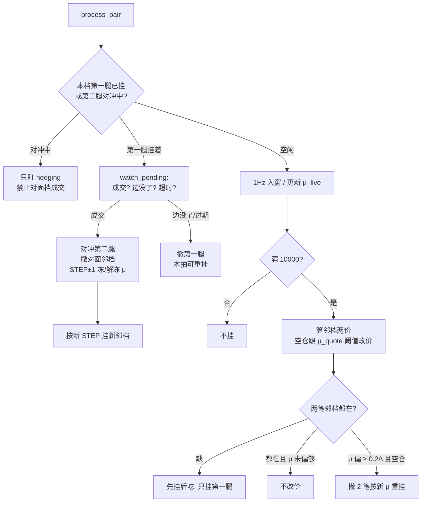

# 滑动窗口 · 阶段 2 开发设计：对称挂限价

依赖：阶段 1 已落地（窗口、\(\mu\)、有符号 STEP、`base_qty`、±N）。  
规格对照：[`滑动窗口-阶段1-追STEP.md`](滑动窗口-阶段1-追STEP.md)

本阶段在 **同一套中枢和库存** 上，把「撞线再市价」改成「邻档限价先挂着，区间来成交」。  
锁定：**取法 A 定格距**；**中枢两侧各一单（邻档）**，不铺满 ±N。  
不改 `exchange/*`、sidecar。执行用现有 **先挂后吃**：第一腿限价，成交后第二腿市价对冲。

阶段 1 必须先跑通。两阶段不要共用一个 `order.style`。

---

## 1. 目标与非目标

**目标**

空仓时在 \(\mu\pm\Delta\) 各挂一档第一腿限价。价差打到哪边哪边成，STEP ±1，再把邻档挪到「下一格加仓 + 往回减仓」。用 maker 吃格距，插针打不穿挂单价就不成交。

**非目标**

- 按 Δ 铺满两侧全部档  
- 用窗口高低点等分 Δ  
- 一笔成交跳多格  
- 替换阶段 1 的窗口算法  
- 无对冲的裸挂单

---

## 2. 与阶段 1 的关系

| | 阶段 1 | 阶段 2 |
|---|---|---|
| 中枢 | 1Hz × 10000，有仓冻 μ | 相同；多 \(\mu_{\text{quote}}\) 改价阈值 |
| STEP | 有符号，±1，过零经 0 | 相同，由 **成交** 推进，不是由 persistence 发市价 |
| Δ | 定格距 | 相同 |
| 何时下单 | 偏离站住 → 双腿市价 | 满窗即挂邻档；成交后挪挂 |
| 过滤插针 | 1 秒 5/7 次达标 | 挂单价离现价约 1Δ |
| `order.style` | `market_taker` | `limit_then_market` |

阶段 1 的 `persistence_min_hits` 在第一腿限价路径上 **不当扳机**。限价超时转市价、第二腿失败紧急市价，仍用现有超时/对冲逻辑。

---

## 3. 总流程

两条环并行：1Hz 入窗（与阶段 1 相同）+ 100ms 盯挂单/改价。



同一时刻每个 slot **最多两个第一腿**（正邻档、负邻档）。任一进入「已成/对冲」必须立刻撤另一档。

---

## 4. 关键步骤说明

### 4.1 中枢（在阶段 1 上多「挂单价」）

入窗、\(\mu_{\text{live}}\)、有仓冻 μ：与阶段 1 第 3.2–3.3 节完全相同。

空仓时拆两个 μ：

| 量 | 更新 |
|---|---|
| \(\mu_{\text{live}}\) | 每秒有样本就更新 |
| \(\mu_{\text{quote}}\) | 仅当 \(\lvert\mu_{\text{live}}-\mu_{\text{quote}}\rvert\ge 0.2\Delta\) 才换成 live，并撤邻档重挂 |

不要每秒改价，也不要每 5 分钟整表跳一次（邻档会被中枢撞成）。

有仓：\(\mu_{\text{quote}}=\mu_{\text{frozen}}\)，挂单价钉死，直到 STEP 回 0。窗口照样更新 live。

### 4.2 邻档定义（相对当前 k）

取法 A：格线在 \(\mu_{\text{quote}}+m\Delta\)，\(m=\pm 1,\ldots,\pm N\)。只挂 **当前 k 的外侧加一格** 和 **内侧减一格**。

**k=0**

| 档 | 价差轴 | 第一腿方向（空贵） |
|---|---|---|
| 正邻 | \(\mu+\Delta\) | 卖 L（随后买 R） |
| 负邻 | \(\mu-\Delta\) | 买 L（随后卖 R） |

**k=+1**（刚在正边成交）

| 档 | 价差轴 | 作用 |
|---|---|---|
| 加 | \(\mu+2\Delta\) | 再空 L 多 R |
| 减 | \(\mu\)（或 \(\mu+h\Delta\) 滞后） | 平回 0 |

**k=+N**：只挂减仓，不挂 \(\mu+(N+1)\Delta\)。  
负仓镜像。过零必须先成减仓到 0，再恢复 ±Δ 两笔，禁止一档里反手。

不铺满：μ 一漂或插针扫过会连成多格，和 ±1 库存拧着，撤改也扛不住。

### 4.3 价差轴 → 某所限价

格线不是单所价格。例：正档要锁 \(s\approx\mu+\Delta\)，空 L 多 R。

1. 用 **对手所当时盘口** 反推本所限价，使成交后可执行价差尽量等于目标格线。  
2. 第一腿挂在 **费率较高的所**（现有 `first_limit_venue`）。  
3. 对手盘口变了：若推出来的限价偏离超过 1 tick（或固定阈值），改价/撤重挂。  
4. 第二腿 **等第一腿成交后市价**，与现网 `limit_then_market` 相同。

挂着期间可执行边消失（点差过宽、盘口没了）→ 撤第一腿，不要用过期价等到成交。

### 4.4 成交与对冲

1. 第一腿成交（含部分：按现网累积，整格 `base_qty` 满了才算这一档成）。  
2. **立刻撤对面邻档**（防插针双边都成）。  
3. 市价对冲第二腿；失败走紧急对冲，禁止裸腿。  
4. STEP ±1；`0→±1` 冻 μ；`±1→0` 解冻。  
5. 按新 k 挂新的加档、减档（缺的才挂，已在的对齐价格）。

对冲未完成前，该 slot 视为 inflight，**不得**让另一档成交（应对面已撤）。

### 4.5 μ 变动对邻档的影响

空仓、μ 慢漂但不足 0.2Δ：两笔挂单价不动。  
空仓、μ 从 0 漂到 0.2Δ：撤 ±Δ 旧单，按新中枢重挂。此时旧正档可能已贴近新中枢，必须先撤再挂，避免「中枢自己撞上挂单」误开。  
有仓冻 μ：加/减线不跟 live，这是减仓还能平回开仓中枢的前提。

铺满两侧时每次定值要动 2N 笔，且容易一次穿多档——本阶段明确不做。

### 4.6 一格收益（与阶段 1 相同，成交方式不同）

\(\mu=0\)，\(\Delta=0.02\)（报价差或 % 与配置一致），数量 \(q\)：

1. 正档在 +0.02 成交：空 L / 多 R 各 \(q\)  
2. 减档在 0 成交：平掉  
3. 毛利 \(\approx 0.02q\) −（第一腿 maker + 第二腿 taker）× 开平两次  

A=100、B=99 若相对 μ 真偏离，逻辑同阶段 1；差别是单子事先挂在 \(\mu+\Delta\)，不是偏离后再两腿市价去追。

---

## 5. 状态机（每 slot）

```
IdleEmpty ──满窗──► RestingTwo          两笔邻档挂着
RestingTwo ──正档第一腿成──► HedgingPlus   撤负档，对冲中
HedgingPlus ──第二腿成──► RestingAtK     k=+1，挂 +2 与回 0
RestingAtK ──减档成──► HedgingFlat      对冲平仓
HedgingFlat ──成──► RestingTwo 或 Idle   回 0 解冻 μ，再挂 ±Δ
RestingTwo ──μ 偏 0.2Δ──► ReplaceTwo    撤重挂，仍空仓
任一 Resting ──边没了──► Cancel 再回到对应 Resting/Idle
```

`k=-1` 对称。强制平仓：撤所有邻档，市价清 \(\lvert k\rvert\) 格（阶段 1 已有路径）。

---

## 6. 模块与改动面（阶段 1 之后）

| 模块 | 职责 |
|---|---|
| `adjacent_quotes`（新，或并进 window 模块） | 由 \(k,\mu_{\text{quote}},\Delta,N,h\) 算出两档目标价差与 Intent 方向 |
| pending | 现网一 slot 一笔 pending；阶段 2 需要 **每 slot 最多两笔** 第一腿（`pending_plus` / `pending_minus`），或拆成两个逻辑子 slot。这是本阶段相对现网最大的执行层扩展，尽量复用 `watch_pending_slot` |
| 成交回调 | STEP、冻 μ、撤对面、补挂邻档 |
| 改价 | 空仓 0.2Δ；对手盘口驱动的限价修正 |
| 配置 | 阶段 2 开关；`quote_reprice_ratio=0.2`；本阶段 `order_style=limit_then_market` |

`WindowGridEngine` 的「撞线发市价」在阶段 2 **关掉**。库存仍用同一 STEP。

---

## 7. 落地顺序

1. 邻档纯函数单测：k=0/±1/±N 的两档价差与方向  
2. 双 pending 或等价结构 + 撤对面  
3. 接 `watch_pending`：成交 → 对冲 → 挪档  
4. \(\mu_{\text{quote}}\) 阈值重挂  
5. paper：空仓两单、正成负撤、回到 0 恢复 ±Δ  
6. 强制平仓撤光挂单  

---

## 8. 验收

- 满窗空仓：恰好两笔第一腿，价差轴约 \(\mu\pm\Delta\)  
- 未满窗：零挂单  
- 正档成交：负档已撤；STEP=+1；随后只有 +2 加仓与回 0 减仓  
- 减到 0：解冻；重新 ±Δ  
- live 漂不足 0.2Δ：不改价  
- 有仓灌偏 live：减仓线仍按冻结 μ  
- 第一腿成、第二腿失败：紧急对冲，无裸腿  
- 插针同时碰到两档：只承认先成的一档  
- 不出现 2N 张网格单
